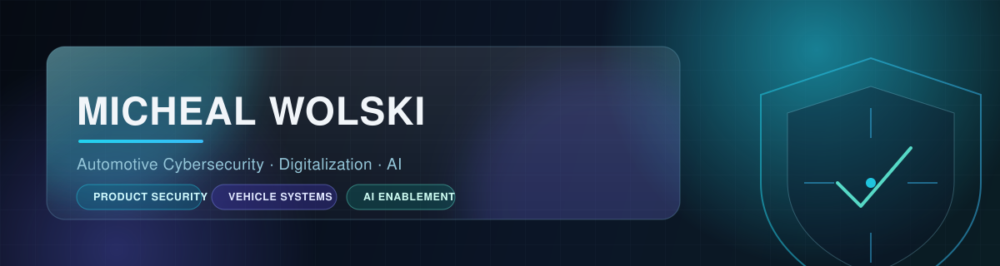
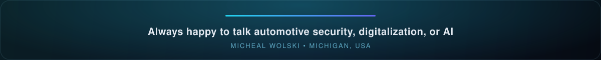

 

Cybersecurity Graduate &#183; Former Bosch Mobility Product Cybersecurity Intern &#183; Michigan, USA

  

## About

I'm an early-career **automotive cybersecurity and digitalization** professional. I build practical solutions that connect cybersecurity, embedded systems, enterprise data, automation, and AI — from Power Platform workflows and security dashboards to AI-assisted knowledge tools, home-lab SOC environments, and hands-on offensive/defensive security work.

<table>
<tr>
<td width="50%" valign="top">

**Focus areas**
Product &amp; automotive cybersecurity &#183; Embedded / vehicle security &#183; Digitalization &amp; process automation &#183; AI enablement &#183; Systems integration &#183; Security operations &amp; analytics

</td>
<td width="50%" valign="top">

**Status**
Michigan, USA &#183; graduating 2026 &#183; open to full-time cybersecurity and security-engineering roles

</td>
</tr>
</table>

## Experience

> ### Bosch Mobility — Product Cybersecurity Intern
> *Farmington Hills, Michigan &#183; 2025 – 2026*
>
> - Supported product cybersecurity and digitalization activities across multiple Bosch Mobility divisions.
> - Designed and built a cross-divisional **cybersecurity visibility platform** (Power Apps intake portal + SharePoint database layer + Power BI executive dashboard) — structured project intake (draft → submitted → returned → archived), division/customer filtering, and automated notifications.
> - Automated a previously manual internal cybersecurity portal workflow and added administrative status visibility.
> - Conducted technical research into **secure boot for safety-critical automotive controllers** through documentation review and subject-matter-expert interviews *(research and technical communication — not production implementation)*.
> - Built an **LLM-powered onboarding and knowledge assistant** with a retrieval-augmented generation (RAG) memory pipeline during an internal AI hackathon.
> - Supported senior-leadership workshops, cybersecurity events, and cross-functional coordination; served as game master during an automotive cybersecurity fire drill.
>
> Public-facing summary only. No confidential Bosch information, data, internal systems, or proprietary material is disclosed.

## Featured Projects

| Project | Description | Status |
|---|---|---|
| [**Network Utility Tool**](https://github.com/michealswolski/network-utility-tool) | PowerShell network utility for Windows 10/11 — DNS benchmarking, diagnostics, and DFIR-oriented tooling. |  |
| [**OBD-II Diagnostic Scanner**](https://github.com/michealswolski/obd2-diagnostic-scanner) | Python vehicle diagnostic scanner with hardware interfacing and ECU protocol handling. |  |
| [**Secure Boot Research**](https://github.com/michealswolski/secure-boot-research) | Research on secure boot for embedded / automotive controllers. |  |
| [**PKI &amp; CA Research**](https://github.com/michealswolski/pki-ca-research) | Analysis of PKI infrastructure vulnerabilities and certificate-authority trust models. |  |

| Project | Description | Status |
|---|---|---|
| **365 Whitepaper Agent** | Bosch internal AI-hackathon project — LLM-powered onboarding agent with a RAG memory pipeline. |  |
| **forecast-ai** | Applied AI / forecasting project. |  |
| **ai-agent-governance** | Framework exploring governance and guardrails for AI agents. |  |
| **document-analyzer-ai** | AI-assisted document analysis and extraction tool. |  |
| **auto-job-intel** | AI-assisted job-search and application intelligence tool. |  |

| Project | Description | Status |
|---|---|---|
| **Bosch Project Database &amp; Dashboard** | Cybersecurity Visibility Platform — Power Apps intake portal, SharePoint database layer, and Power BI reporting. |  |
| [**Wolski Command Center**](https://github.com/michealswolski/wolski-command-center) | Full-stack Raspberry Pi home-lab dashboard — React, Node.js/Express, SSH, system monitoring, file management, AI-assisted administration. |  |
| [**Portfolio Site**](https://michealswolski.github.io) | Personal cybersecurity portfolio — React + Vite, deployed on GitHub Pages. |  |
| **S650 Mustang Mod Tracker** | React build-management app for tracking vehicle modifications. |  |

Earlier / archived work: <a href="https://github.com/michealswolski/ford-ecu-detector">Ford ECU Detector</a> &#183; <a href="https://github.com/michealswolski/meshlink-ios">MeshLink</a> (encrypted BLE P2P messaging concept) — no longer actively maintained.

## Security Operations &amp; Home-Lab Work

Hands-on, authorized lab environments covering the full detect → respond → harden lifecycle.

| Lab | Focus |
|---|---|
| **offensive-security-lab** | Full offensive-security lab — reconnaissance, Nmap, Metasploit exploitation *(owned/authorized systems only)* |
| **splunk-siem-lab** | Splunk SIEM — SPL queries, dashboards, spike-based alerting |
| **network-traffic-analysis** | Wireshark deep-packet-inspection lab — TCP handshakes, DNS queries |
| **python-log-automation** | Python brute-force detection engine — regex log parsing, rolling IP counts |
| **openvas-scanning** | OpenVAS vulnerability scanning — CVE/CVSS analysis, risk-prioritized mitigation |
| **homelab-vuln-management** | End-to-end vulnerability-management lifecycle lab |
| **system-hardening-lab** | Windows &amp; Linux endpoint hardening baselines |
| **firewall-vpn-lab** | pfSense network segmentation, deny-by-default rules, OpenVPN |

Plus CAN bus / OBD-II monitoring and a Security-Operations traffic-analysis lab (Wireshark, Security Onion) from academic coursework.

## Skills

**Automotive &amp; Embedded Security**
Automotive cybersecurity fundamentals &#183; CAN bus &#183; OBD-II &#183; Secure-boot concepts &#183; HSM &amp; root-of-trust concepts &#183; ECU architecture awareness &#183; ISO/SAE 21434 &#183; UN R155 / R156 &#183; AUTOSAR SecOC &#183; V-model &#183; TARA (conceptual) &#183; OTA &amp; software-download security

**Enterprise Digitalization**
Power Apps &#183; Power Automate &#183; Power BI &#183; Dataverse &#183; SharePoint &#183; Workflow &amp; intake design &#183; Process automation &#183; Dashboards &#183; Requirements gathering

**AI &amp; Data**
AI agents &amp; assistants &#183; Retrieval-augmented generation &#183; Prompt design &#183; Vector-database concepts &#183; Data visualization

 

  

## GitHub Stats

## Education

> ### Eastern Michigan University — B.S. Information Assurance &amp; Cyber Defense
> *Cum Laude &#183; GPA 3.66 &#183; Ypsilanti, MI &#183; Graduated 2026*
>
> ### Henry Ford College — A.A.S. Cybersecurity
> *Dearborn, MI &#183; Graduated May 2023 &#183; Dean's List*

## Professional Development

`Auto-ISAC Cybersecurity Summit 2026` `IQPC Automotive Cybersecurity Conference 2026` `Bosch Internal Cybersecurity CTF` `Bosch Internal AI Hackathon` `Automotive Cybersecurity Fire Drill` `Senior-Leadership Workshops` `Corporate IP &amp; Data-Protection Training` `Secure-Boot SME Interviews` `Automotive Innovations Tech Day`

## Currently Exploring

Enterprise AI agents &amp; knowledge assistants &#183; Agentic cybersecurity tools for authorized labs &#183; Raspberry Pi &amp; mobile-accessible system management &#183; Router / IoT security research (authorized) &#183; REVV automotive community platform &#183; Automotive embedded-security research &#183; Power Platform automation &#183; Azure fundamentals &#183; Databricks-style enterprise analytics

 

 

